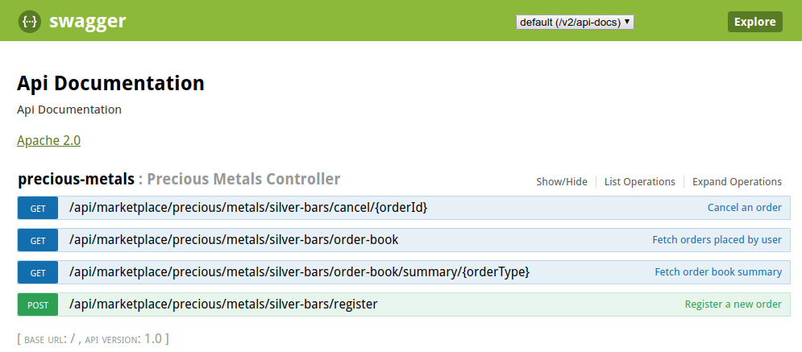

# marketplace services
As name suggest this solution is a REST service implementation that enable "Live Order Board" for a company called Silver 
Bars Marketplace. Services provide market demand for silver bars.

A simple version of services are implemented with some consideration towards transactional boundaries. The service does 
not implement the complete lifecycle of a trade; however an attempt has been made to provide a way to enable required 
state-machines.

Spring framework is used extensively for a quick turnaround. Two different ways of communication is enabled:
* By calling the rest endpoints
* Asynchronous messaging for communication (limited to registration of a new order)

Messaging platform is implemented using an embedded AMQ broker.

### Limitations

* Two prime concerns (security and reliability) are not dealt in this implementation.
* Domain models are kept to minimal. 
* Validation are not in place to validate orders.
* Test coverage requires improvement. 

## API Documentation
Swagger is used for API documentation and swagger ui url is [`http://localhost:8080/swagger-ui.html`](http://localhost:8080/swagger-ui.html).

# Features
## Register an order
An order can be registered in two ways:
 1. By calling the endpoint `/api/marketplace/precious/metals/silver-bars/register` 
 2. Or by sending a message on queue `precious-metals-silver`.

@RequestHeader: USER_ID - User name to be passed in the header 
@RequestBody: [`OrderRequest`](/src/main/java/com/inspiware/marketplace/services/domain/OrderRequest.java)

### Implementation Note
* Registering an order using asynchronous messaging does not guarantee an order placement on the books. A matching acknowledgement
does confirm the placement of the order in the order-book. However, Integration flow is not complete.

## Cancel a registered order
An order can be cancelled by calling the endpoint `/silver-bars/cancel/{orderId}` where orderId parameter is the identifier
of the order to be cancelled. 

@RequestHeader: USER_ID - User name to be passed in the header 
@PathVariable: orderId - order identifier

* If the order exists and registered by the given userId then the order is removed from order book.
* If the order exists but not registered by the given userId; order is not cancelled and a rejection message is sent back with the response.
* If the order doesn't exists then invocation call is rejected and response contains a rejection message. 

### Implementation Note
* A user can only cancel orders placed by them. 
* Partial cancellation is not possible. An order can only be cancelled in full.
* Order can only be cancelled if matches to an existing order for the given user identifier.

## Get summary information of live orders
Summary of live orders can be retrieved by calling the endpoint `/silver-bars/order-book/summary/{orderType}`
where orderType parameter could be `BUY` or `SELL`. 

@PathVariable: orderType - order type; permissible values are BUY or SELL.

# Design Considerations

## Reliability
No implementation has been done to achieve this feature. But the service is small and can be containarized 
that will help achieve this goal. 

## Scalability
Load-balanced endpoints will allow to have multiple instances of this services running in parallel. 
However to achieve scalability for asynchronous communication; choice of underlying infrastructure 
(broker, etc...) will be key. 

## Security 
Security implementation is not in the scope of this exercise.

# Running the Project
## Requirements
Gradle 4.4+
JDK 1.8

## How to run
To run the project locally, use the command:

**./gradlew bootRun**

It will start the REST services, start an local ActiveMQ broker and also start the Spring integration flows, 
initialize input/output channels.

